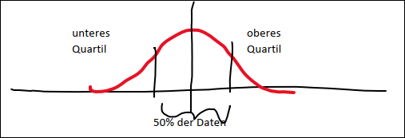

# Mengenoperationen

## Lernziele

Die Kursteilnehmer

* kennen die Basisrechenregeln der Mengenlehre
* können mit diesen Rechenregeln Terme umformen und unter Umständen vereinfachen
* können diese Regeln auf den Matlab Datentyp Table anwenden

## Aufgabenstellung

#### Aufgabe 1: Umformen von Termen

1. A &cup; (A &cap; B)
2. A &cap; (A &cup; B)
3. B \ (B &cup; C)
4. B \ (B &cap; C)
5. A &cup; (B \ (C &cap; A))
6. A \ ((B &cup; C) &cap; (A &cup; C))

#### Aufgabe 2: Mengenoperationen des Datentyp "table"

Wir verwenden für diese Übung denselben Datentype wie in Übung 1 (`MET_Office_Weather_Data.csv`). Wir betrachten aber nur die Daten des Jahres 2020. 

Wir verwenden die Rechenregeln, um diejnigen Datensätze zu selektieren, die bezülgich `tmin` innerhalb der 25% Quartile liegen. 

1. Erstellen von Teilmengen:
   1. Konstruieren Sie die Teilmenge der Daten des Jahres 2020 und halten Sie diese Menge in der Variable data2020 fest (entfernen Sie ungültige Werte) 
   2. Bilden Sie die Teilmenge aboveMedian, welche alle Daten enthält, mit tmin > median(tmin). Bilden Sie die Teilmenge belowMedian, welche alle Daten enthält, mit tmin <= median(tmin)
   3. Wiederholen Sie dieses Verfahren für diese zwei Teilmengen und definieren sie jeweils zwei neue Namen für diese Teilmengen
2. Welche Wetterstationen haben ein tmin, welches zwischen unterem und oberem Quartil ist? – Das sind sollten 50% aller Datenätze sein. Prüfen Sie.
3. Schreiben Sie die Mengenoperationen, die Sie ausgeführt haben als Formel auf.
4. Welchem Bereich entspricht diese Menge in einem Boxplot?

## Geforderte Lösungsbereiche

* Programmcode

## Verwendete MatLAB Funktionen / Plots
